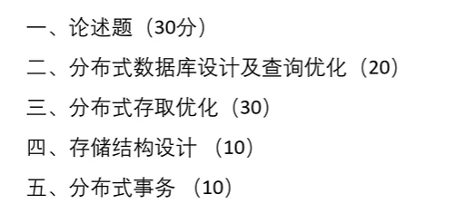

# 大数据存储与管理

论述题不要死记硬背，要有一点自己的观点

## 第一章

1. 大数据的由来：（为什么会产生大数据存储系统）

①**横向扩展的需求** 成为击败关系数据库的关键！ **②系统可靠性的需求**

2. 大数据需要怎样的存储系统？

   满足大数据存储的集群系统，应该满足以下条件:

   ①能够对集群内的计算机及存储资源进行统一管理、调度和监控

   ②能够对集群内的数据进行分散存储和统一管理

   ③集群内的计算机可以共同完成一个任务，分工协作、负载均衡

   ④当集群中某一台计算机发生故障，集群可以保证功能的有效性且数据不会丢失(分区容错性)
   ⑤可以用简单的方式部署集群、扩展集群以及替换故障节点(伸缩性)

3. NewSQL数据库的特点

   ①解决了NoSQL的三个缺点： “No ACID” 问题、“低级查询语言” 问题、 “无标准” 问题

   ②**保留 NoSQL 的扩展性**：通过分布式架构实现水平扩展，能随业务增长动态加节点，应对高并发、海量数据场景。

   ③**高性能 + 高可用**：优化了存储引擎和并发控制，兼顾低延迟；多副本 + 故障自动切换，保障服务持续可用。

   (注：

   - 解决 “No ACID” 问题：支持完整的 ACID 事务特性（原子性、一致性等），能保障数据的可靠性，适合金融交易这类对一致性要求高的场景。

   - 解决 “低级查询语言” 问题：兼容标准 SQL 语法，用熟悉的高级查询语言操作，降低开发和学习成本，也能无缝迁移传统 SQL 业务。

   - 解决 “无标准” 问题：遵循 SQL 等行业标准，避免 NoSQL 的碎片化，便于系统整合和维护。)

     

## 第二章

1. 客户/服务器的体系结构(不同体系结构中AP功能的变化)

   ①集中库AP/DP架构   ：适用于早期集中式数据管理场景（数据量较小、需强集中管控），比如传统银行柜台终端系统、企业内部单一数据中心的批量报表查询系统。

   ②网络数据库系统架构 （单服务器多客户端 AP/DP 架构）： 适用于部门级中型数据应用（多用户共享数据、数据量中等），比如企业 OA 系统、小型电商平台的后台管理系统（客户端 AP 处理用户操作逻辑，数据统一由服务器 DP 管理）。

   ③分布式数据库系统架构（多服务器多客户端 AP/DP 架构）：适用于大数据分布式存储场景（海量数据、跨地域业务），比如电商跨区域订单系统、物流多节点仓储数据管理系统（DP 实现数据分片存储，AP 协调多节点数据访问）。

   ④分布式数据库系统架构（Server-to-Server 胖客户端）：适用于大规模复杂业务的大数据系统，比如跨国企业集团财务数据管理系统、大型工业物联网数据采集分析系统（胖客户端 AP 处理本地复杂计算，多 DP 分散存储海量异构数据）。

2. 分库分表架构、存算分离架构的概念及优缺点

   ****

   **分库分表架构：**

   概念：即无共享**（Shared-Nothing）分布式集群架构（如OceanBase **数据库），各个节点之间完全对等，每个节点都有自己的 SQL 引擎、存储引擎、事务引擎，运行在普通 PC 服务器组成的集群之上。

   优点：具备高可扩展性、高可用性、高性能、低成本、与主流数据库高兼容等核心特性。

   缺点：扩展性能差，扩容过程复杂，灵活性差。

   **存算分离架构：**

   概念：**存算分离**是指将系统的**计算资源**（CPU、内存，负责执行计算逻辑）与**存储资源**（硬盘、持久化介质，负责数据保存）在物理和逻辑上彻底解耦。

   ​	其中有**共享存储型**和**计算-内存-存储分离型**两种，与前者相比，后者共享缓存，**扩展了共享存储架构的写能力**；共享缓存**确保了用户可以从集群中的任何一个节点访问到完整的、一致的数据库内容**；消除磁盘 I/O 瓶颈，大幅提升性能；更高级别的高可用。

   优点：提升了系统整体的可用性和扩展性

   缺点：网络 I/O 延迟、系统复杂度提升、依赖网络稳定

3. 关系型分布式数据库系统的模式结构

   

4. 分布式数据库系统的数据透明性(定义，**举例**)

   **分片透明性**(最高级别，跟在本地没有区别):分片是将一个关系分成几个子关系，每个子关系称为一个分片。用户不必考虑数据属于哪个分片的性质称为分片透明性。位于全局概念模式和分片模式之间。
   **分配透明性**:分布数据库支持**有控制的数据冗余**，即数据可重复存储在不同的场地上。用户不必考虑各个片段的存储场地称为分配透明性。位于分片模式和分配模式之间。
   **局部映射透明性**:用户不必考虑数据的局部存储形式称为局部映射透明性。位于分配模式与局部概念模式之间。

   举例：考虑全局关系SUPPLIER(SNO,SNAME,SCITY)被划分为S1、S2，若S1存放于站点1上，S2有一个副本，分别放于站点2和站点3上，现编写一个名为SUPQUIRY的简单查询应用程序，它将从终端接收一个供应商号，查询该供应商号相应的供应商名，并将它显示在屏幕上。

   

5. 多数据库系统和分布式数据库系统的区别与联系

   ①数据模式是否预先定义
   ②DBMS是否同构
   ③查询优化策略是否自动生成
   ④是否一定存在局部用户

## 第三章

1. 分布式数据库设计的分片原则、定义、表示方法
2. 证明分片原则的正确性
3. 分布式数据库的查询优化策略及片段查询优化方法
4. 分布式查询的存取优化方法、特征参数的计算(选择运算、投影运算、自然连接运算、半连接运算)

## 第四章

1. H Base 解决了 HDFS 的哪些问题?具有哪些特点?

   (1)HDFS不支持对数据的随机读取
   (2)HDFS没有数据表的概念
   (3)HDFS无法针对行数统计、过滤扫描等常见数据查询功能实现快捷操作，一般需要通过Mapreduce实现。

   HBase底层采用HDFS存储，但是文件结构和元数据等自身维护。**具体来说具有以下特点**:
   (1)采用面向列加键值对的存储模式

   (2)可实现便捷的横向扩展
   (3)可以实现自动的数据分片
   (4)实现较为严格的**读写一致性**和自动故障转移

2. H Base数据库中region的含义及其特性。这句话如何理解?

   **含义**：Region是一段数据的集合，表的一部分数据。HBase是-个会自动分片的数据库。一个Region就相当于关系数据库中分区表的一个分区，或者一个分片。

   HBase表一般拥有多个Region。Region具有如下**特性**：

   Region不能跨服务器，一个RegionServer上有一个或多个Region

   当数据量增大时，Region会发生分裂

   出于负载均衡的需要，Region会发生迁移

   Region所有的数据存取操作都是调用HDFS的客户端接口实现的

   

3. H Base增删改查的真正操作内容是什么？

   HBase 的增删改查并非传统数据库的 “直接修改 / 删除原数据”（因底层 HDFS 不支持修改），而是基于 “追加数据 + 版本管理” 实现的，具体操作如下：

   ①**新增**：直接在 HDFS 中追加一条新的单元格数据，完成新增。

   ②**修改**：不改动原数据，而是在 HDFS 中追加一条同单元格的新数据（版本号高于旧版本）；后续查询会优先读最新版本，实现 “修改” 效果。

   ③**删除**：不删原数据，而是追加一条 “墓碑标记（Tombstone）” 数据（无 value、类型为 Delete）；查询时会跳过被标记的记录，实现 “逻辑删除”。

   ④**查询**：读取数据时，获取目标单元格的最新版本数据，同时自动忽略已被墓碑标记的记录。

   这种 “只追加” 的方式会导致数据冗余、连续性差，因此 HBase 会定期执行**Compaction（合并）操作**：将多个 HFile 合并为一个文件，合并时会真正删除带墓碑标记的记录、清理旧版本数据，以此提升性能。

4. H Base的读写流程

   ①HBase 读流程

   1. **定位 hbase:meta 表**：客户端访问 ZooKeeper 的`/hbase/meta-region-server`节点，查询到存储`hbase:meta`表的 RegionServer 地址；
   2. **查询目标 Region**：客户端连接该 RegionServer，通过`hbase:meta`表（存储了所有 Region 的行键范围信息），找到目标行键对应的 Region 及所属的 RegionServer；
   3. **读取数据**：客户端连接目标 RegionServer，先从`MemStore`（内存缓冲区）中查找数据；若未找到，则读取底层的`HFile`（持久化存储文件）；
   4. **缓存优化**：第一次访问后，客户端会将`meta`信息缓存到`BlockCache`中，后续操作可直接从缓存获取`meta`信息，提升访问效率。

   ②HBase 写流程

   1. **定位目标 Region**：与读流程一致，客户端通过 ZooKeeper 找到`hbase:meta`表的 RegionServer，查询到目标行键对应的 Region 及所属的 RegionServer；
   2. **写入日志与内存**：客户端连接目标 RegionServer，将数据分别写入`HLog`（预写日志，保障数据不丢失）和`MemStore`（内存缓冲区）各一份；
   3. **刷写持久化**：当`MemStore`中的数据达到阈值时，会被异步刷写成一个新的`HFile`文件；
   4. **合并与拆分**：多个`HFile`达到一定大小后，会触发`Compaction`操作合并为一个大`HFile`；当`HFile`过大时，会触发`Split`（拆分），将当前 Region 拆分为两个新 Region；
   5. **数据恢复**：若`MemStore`中的数据丢失，可通过`HLog`进行数据恢复。

5. HBase数据库设计rowkey和列族的原则和方法

   ①RowKey 的设计原则

   1. **长度原则**
      - RowKey 是二进制码流，最大长度 64KB，实际应用中建议设为 10-100 字节，最好不超过 16 字节；
      - 若 RowKey 过长，会降低 HBase 内存的有效利用率（HBase 会加载部分数据到内存）。
   2. **散列原则**
      - 避免将递增字段（如时间戳）放在 RowKey 高位，需通过散列处理让数据均衡分布，避免单个 RegionServer 负载过高（热点问题）；
      - 核心目标是提升各 RegionServer 的负载均衡率。
   3. **唯一原则**
      - RowKey 需包含能唯一标识记录的信息（如通话记录的 “主叫号码 + 被叫号码 + 时间”），确保每行数据的唯一性。

   ②RowKey 的设计方法

   1. **加盐（Salting）**
      - 在 RowKey 前缀添加随机数（如 0-499 的随机数），打散数据分布，避免热点；
      - 案例：通话记录 RowKey 设计为 “随机数 + 主叫号码 + 被叫号码 + 时间”。
   2. **反转**
      - 对固定格式 / 开头重复的 RowKey（如手机号）进行反转，打破数据集中分布；
      - 案例：将手机号 “139xxxxxx” 反转为 “xxxxxx931” 作为 RowKey 部分，避免热点。
   3. **预分区**
      - 预先创建 HBase 表的分区，结合 “加盐” 使用，解决自动 Region 拆分的两个问题：热点问题、拆分合并风暴；
      - 操作示例：`create 't1','f1', SPLITS => ['10','20','30','40']`（预先划分分区范围）。

   ③列族的设计

   文档中 HBase 表结构采用了单 “name” 列族，结合 HBase 通用设计原则：

   1. **数量精简**：建议列族数量为 1-2 个（过多会增加 RegionServer 的资源开销）；
   2. **属性相近**：同一列族下的列需具有相似的访问模式、数据类型（如文档中 “name” 列族包含 “product”“user” 相关列）；
   3. **适配访问频率**：将访问频率相近的列放在同一列族，避免不同频率的列互相影响。

## 第五章

(1)跳跃表

内存结构

解决的问题类型(快速写入、更新代价低、支持区间查询)

**查找和插入的流程(实现原理)：**

1.查找流程

查找的核心思路是 “从高层索引往下跳，逐步缩小范围”，步骤如下：

1. **起点设置**：从跳跃表的 “最高层索引的头部节点” 开始（相当于从最高速的高架路出发）。

2. 同层遍历判断

   ：看当前节点的 “下一个节点的键值”：

   - 如果下一个节点的键值 ≤ 要查找的目标值，就顺着当前层链表往后走（继续在高架路前进）；
   - 如果下一个节点的键值 ＞ 目标值，就切换到当前节点的 “下一层节点”（下高速，走下层道路）。

3. **逐层下沉**：重复第二步，直到降到最底层的原始链表。

4. **确认结果**：在原始链表中找到目标键值，返回对应数据；如果遍历到链表尾部还没找到，说明目标数据不存在。

举个例子：查找键值 15（参考文档中的流程）

- 从最高层（比如第 2 层）索引的 1 开始，下一个节点是 7（≤15），继续走；下一个节点是 14（≤15），继续走；下一个节点是 +∞（＞15），切换到下一层。
- 到第 1 层索引，当前节点是 14，下一个节点是 17（＞15），切换到原始链表。
- 在原始链表中，14 的下一个节点是 16（＞15），说明 15 不存在。

2.插入流程

插入的核心是 “先找位置，再插节点，最后建索引”，步骤如下：

1. **查找前驱节点**：按照上面的 “查找流程”，找到目标键值在 “原始链表中应该插入的位置”，记录这个位置的 “前驱节点”（比如要插 10，先找到原始链表中 10 的前一个节点 9）。

2. **插入原始节点**：在原始链表的前驱节点后面，插入新的节点（把 10 插在 9 和 12 之间）。

3. 随机生成索引高度：用随机算法确定这个新节点要建多少层索引（比如生成高度 3，就需要在第 1、2、3 层索引都插入这个节点）。

   - 随机算法逻辑：默认 p=1/4 或 1/2，从高度 0 开始，每次随机生成一个 0~1 的数，如果小于 p，高度就 + 1，直到生成的数≥p 为止，最终高度 = 当前值 + 1。

4. 插入索引节点

   - 如果生成的高度＞跳跃表当前的最高层，就把跳跃表的高度提升到新高度，同时更新头部、尾部节点的指针，让新节点成为高层索引的一部分；

- 如果生成的高度≤当前最高层，就顺着前驱节点的各层对应节点，插入新节点的索引，调整前后节点的横向指针（比如在第 1、2 层索引的 9 和 12 之间，都插入 10 的索引节点）。

举个例子：插入键值 10（参考文档中的流程）

- 先找到原始链表中 10 的前驱节点 9；
- 在原始链表中插入 10；
- 随机生成高度 3（假设）；
- 因为高度 3＞原来的最高层 2，所以提升跳跃表高度到 3；
- 分别在第 1、2、3 层索引中，插入 10 的节点，调整各层前后节点的指针，最终 10 在 3 层索引中都存在，能被快速查到。

(2) LSM 树
内存＋外存结构

①**什么是****compaction**? 分为哪两种类型、各自优缺点

1. 定义：LSM 树异步执行的文件合并操作，解决磁盘文件过多问题，清理无效数据、提升读取性能。
2. 两种类型及优缺点：
   - major compact（全量合并）：
     - 优点：合并后仅 1 个文件，读取性能最优
     - 缺点：耗时久、耗带宽，不宜频繁使用
   - minor compact（局部合并）：
     - 优点：操作范围小、IO 少，快速减少文件数、提升读取性能
     - 缺点：无法全局合并，优化效果有限

②为什么说 LSM **树是一种写入友好的数据结构**?

- 写入转化为顺序写（append），无随机写（seek+write），契合磁盘性能特点；
- 适配 HDFS（擅长顺序写、不支持随机写），适配底层存储；
- 双 MemStore 设计：一个接收写入，一个异步 flush，写入不中断，性能稳定。

(3)布隆过滤器
解决的问题类型
构造方法和查询过程(实现原理)：

**构造方法**（插入过程）
①初始化：创建长度为 m 的二进制数组（全 0），准备 k 个独立哈希函数；
②插入元素：对每个要存入的元素，用 k 个哈希函数计算得到 k 个哈希值，分别对数组长度 m 取模，得到 k 个索引位置；
③标记数组：将数组中这 k 个索引位置的数值设为 1。
**查询过程**（实现原理）
①计算索引：对要查询的元素，用与插入时相同的 k 个哈希函数，得到 k 个索引位置；
②校验判断：若所有索引位置的数组值均为 1 → 元素 “可能存在”（存在误报）；
若任一索引位置的数组值为 0 → 元素 “肯定不存在”（无漏报）。

**不同索引结构的适用场景**

1. B + 树：需平衡读写性能、支持范围查询的场景（如传统关系型数据库 MySQL）；

2. 跳跃表：内存中的高效索引、并发写入场景（如 LSM 树的内存部分 MemStore）；

3. LSM 树：写入密集、底层存储为 HDFS（仅支持顺序写）的大数据场景（如 HBase）；

4. 布隆过滤器：需快速判断 “元素是否存在”、允许少量误报、追求省空间和高查询速度的场景（如新闻推荐去重、缓存穿透防护、大数据集快速去重）；

## 第六章

(1) **嵌套事务的概念**：嵌套事务是指一个事务的执行包 括另一个事务。其中，内部事务 称为外部事务的子事务，外部事 务称为子事务的父事务。

(2) **分布式数据库的一致性级别的内容**，并可举例说明

要求更新过的数据即刻能被后续的访问都能看到，这是强一致性（火车站售票）

如果能容忍后续的部分访问不到，则是弱一致性（网购系统）

如果经过一段时间后要求能访问到更新后的数据，则是最终一致性（银行转账系统）

(3) 分布式数据库的CAP理论和BASE理论

CAP**理论**：一个分布式系统不可能同时满足一致性（C： Consistency）、可用性（A：Availability）和分区容 错性（P：Partition tolerance）这三个基本需求，最 多只能同时满足其中两项。

**BASE**是Basically Available（基本可用）、Soft state （软状态）和Eventually consistent（最终一致性） 三个短语的缩写。BASE**理论的核心思想是**：即使无法做到强一致性， 但每个应用都可以根据自身业务特点，采用适当的方式来使系 统达到最终一致性。

- 执行 1：局部可串行化，全局不可串行化；
- 执行 2：局部可串行化，全局可串行化。

(4) 分布式事务提交协议(两阶段提交协议执行流程，存在的问题，解决的方法)

(5) HBase的一致性ACID特性的实现方法

1. 原子性（要么全成、要么全败）

- **核心定位**：HBase 是 CAP 理论的**CP 系统**，牺牲部分可用性保强一致性。
- **行级事务**：单个 put 是行级事务，通过**行锁（CountDownLatch 互斥锁）** 保障单行操作不可分割。
- **批量操作**：多行批量写入用**两段锁协议**，统一管控 Region 内多行锁的获取 / 释放。
- **兜底保障**：所有操作先写**WAL 预写日志**，再写内存 MemStore；故障时通过 WAL 恢复未完成事务。

2. 一致性（数据状态合法无冲突）

- **存储唯一**：每条数据仅存于一个 Region，同一时间一个 Region 仅分配给一个 RegionServer，避免多副本冲突。
- **写写并发控制**：通过**行锁**避免同一行数据的并发写入 “KV 交叉” 问题，保障写入串行执行。
- **批量操作一致**：多行批量写入时，通过**两段锁协议**控制锁生命周期，保全局一致性。

3. 隔离性（事务间互不干扰）

依赖**锁机制 + MVCC**实现：

- 基础锁机制：
  - 互斥锁（基于 CountDownLatch）：单行锁，保障单行操作互斥。
  - 读写锁（基于 ReentrantReadWriteLock）：读共享、写互斥，隔离读写操作。
- MVCC 机制：
  - 给写事务分配 Region 级自增序列号；
  - 读请求仅可见 “已完成的最大写事务序列号” 之前的数据，避免脏读。

4. 持久性（事务提交后数据不丢失）

基于**WAL 预写日志**实现，提供 4 种持久化策略（按持久性从弱到强）：

1. **SKIP_WAL**：不写 WAL，性能最优但 RegionServer 宕机丢数据。
2. **ASYNC_WAL**：异步写 WAL 到磁盘，异常可能丢少量数据。
3. **SYNC_WAL**：同步写 WAL 到系统缓存，系统宕机不丢数据、缓存掉电可能丢。
4. **FSYNC_WAL**：WAL 写入后立即同步落盘，持久化最强但性能最差。

- **操作流程**：先写 WAL 日志，再写内存 MemStore，保障持久化兜底。

(6) 三阶段提交协议与两阶段提交协议的区别

3PC 是 2PC 的改进版本，核心目标是解决 2PC 的阻塞问题，两者在阶段设计、故障处理、协议复杂度等方面存在显著差异，具体区别如下：

| 对比维度   | 两阶段提交（2PC）                           | 三阶段提交（3PC）                                        |
| ---------- | ------------------------------------------- | -------------------------------------------------------- |
| 核心定位   | 分布式事务基础协议，追求简单                | 2PC 改进版，解决阻塞问题，追求高可用                     |
| 阶段划分   | 2 阶段：决定段（Prepare）、执行段（Commit） | 3 阶段：投票表决、准备提交、执行                         |
| 阻塞问题   | 存在同步阻塞（参与者长期等待）              | 无阻塞（超时机制 + 参与者自主决策）                      |
| 故障恢复   | 依赖新协调者重启决策                        | 参与者自主根据状态决策，无需等待新协调者                 |
| 适用场景   | 小型分布式系统、低并发场景                  | 大型分布式系统、高并发核心业务场景                       |
| 核心优缺点 | 优点：简单易实现；缺点：阻塞、单点问题      | 优点：解决阻塞、高可用；缺点：协议复杂、网络分区易不一致 |

## 第七章

1. 并发控制的基本概念(解决的问题、可串行化调度)

   ①核心目的：保证事务**隔离性**，最终确保数据**一致性**（解决多事务并发的错误）。

   ②解决的并发错误：

   - 丢失修改：事务对数据的修改被其他事务覆盖。
   - 不可重复读：同一事务内多次读同一数据，结果不一致。
   - 读脏数据：读取其他事务未提交（后回滚）的无效数据。

   ③可串行化调度：并发事务的执行结果，等价于某一串行执行顺序的结果（并发控制的正确性准则）。

2. 分布式并发控制解决的问题: 实现分布事务的**可串行性**，同时保持事务的良好并发度，保障系统性能。

3. 分布式事务可串行化判定

   

   - 执行 1：局部可串行化，全局不可串行化；
   - 执行 2：局部可串行化，全局可串行化。

4. 三种分布式锁的应用场景及具体解决方案

   ①**基于数据库的分布式锁**

   具体解决方案：

   1. 用 MySQL 建锁表，将共享资源 ID 设为**主键 / 唯一索引**；
   2. 加锁：插入资源 ID 到锁表（唯一索引保证互斥，插入失败则加锁失败）；
   3. 解锁：删除锁表中对应资源 ID 的记录；
   4. 问题处理：锁表加**有效期字段**（解决断网未释放锁）+ watch dog 机制（任务未完成时续期）。

   应用场景：系统依赖数据库、并发量不高的分布式资源控制场景。

   ②**Redis** **分布式锁**

   具体解决方案：

   1. 加锁：用`setnx key value`（key 不存在则设置，实现互斥）；
   2. 解锁：`del key`；
   3. 问题处理：给 key 设置**过期时间**（解决服务挂了未释放锁）。

   应用场景：高并发、性能要求高的场景（如电商秒杀 “超卖” 问题的资源控制）。

   ③**ZooKeeper** **分布式锁**

   具体解决方案：

   1. 先创建锁目录；
   2. 加锁：在锁目录下创建**临时顺序节点**，判断自身是否为最小节点（是则加锁成功；否则监听前一个节点）；
   3. 解锁：删除自身对应的临时顺序节点（前序节点监听到变化后尝试加锁）。

   应用场景：可靠性要求高、能容忍一定性能损耗的场景（如分布式任务调度）。
